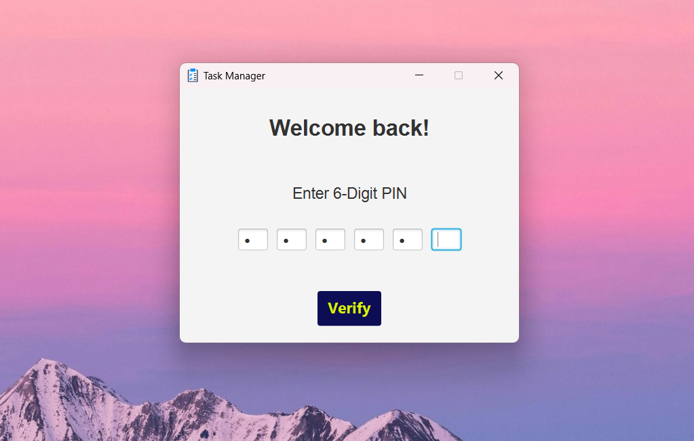
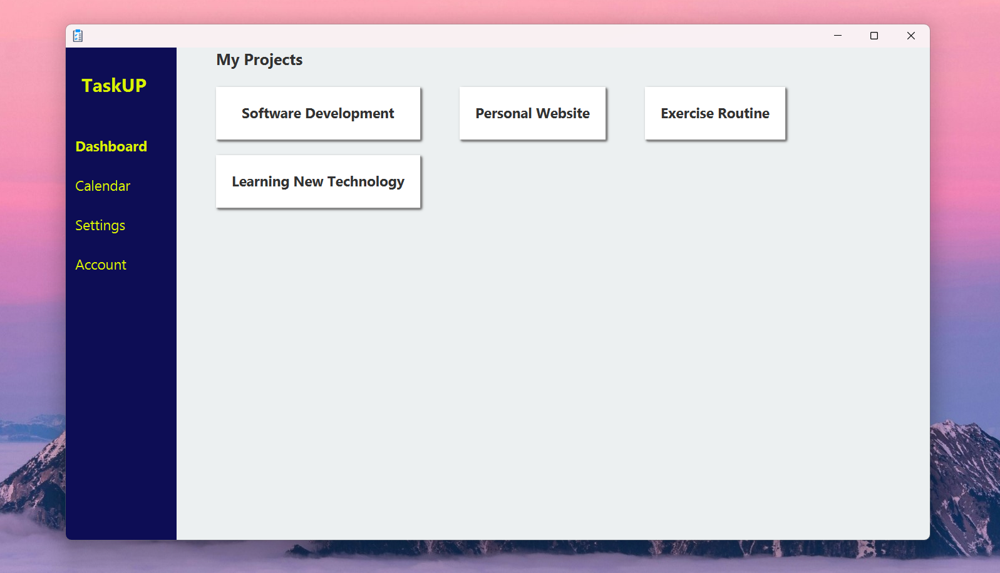
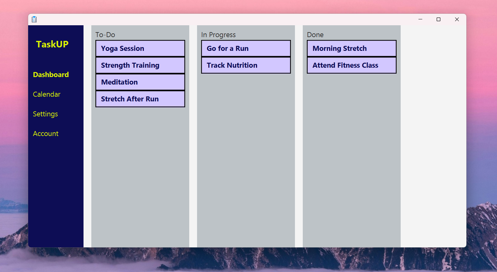
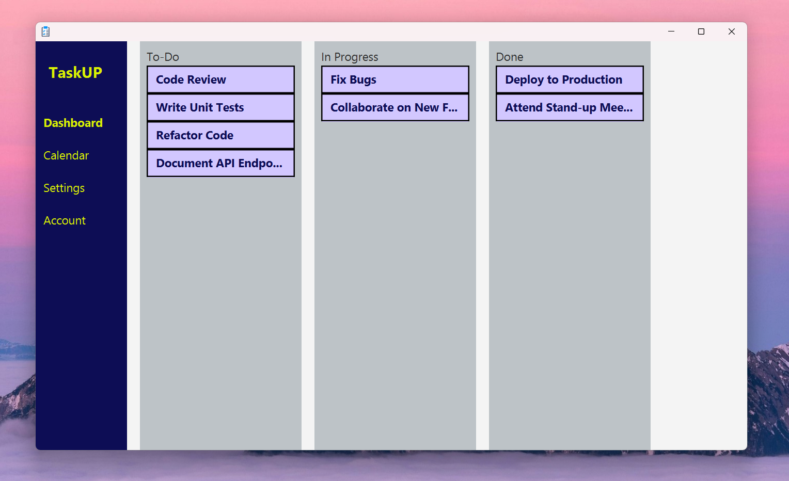

# Creating a Java GUI Desktop App with JavaFX

> [!WARNING]
> Currently, this project is only for displaying projects and tasks based on the stored data. Users still cannot create, update, or delete tasks.

## Login Window

## Dashboard Scene with Dynamic View to Display All Projects

## Dynamic View to Display Tasks
### Tasks - Exercise Routine

### Tasks - Software Development

---

---

All data used by the app is managed through the [AppData](src/main/java/farrel/ad/taskmanager/storage/AppData.java) class. This includes a `Map<String, Project> projectsData = new HashMap<>();` attribute, where all project data is stored.Any changes made in `AppData` will automatically and dynamically update the view.

